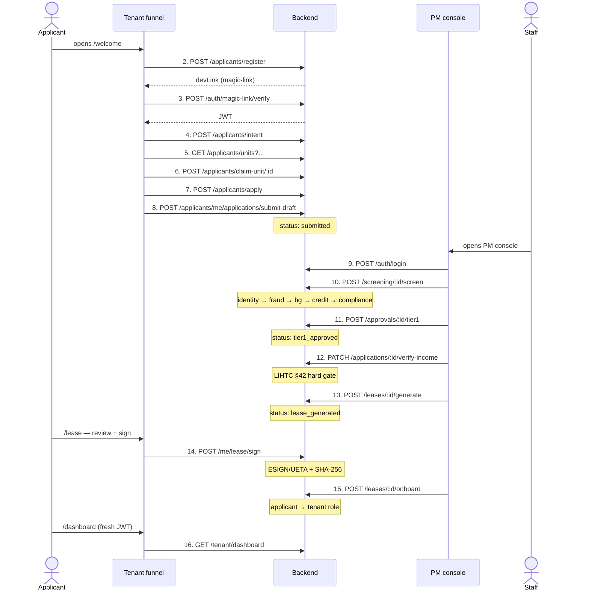
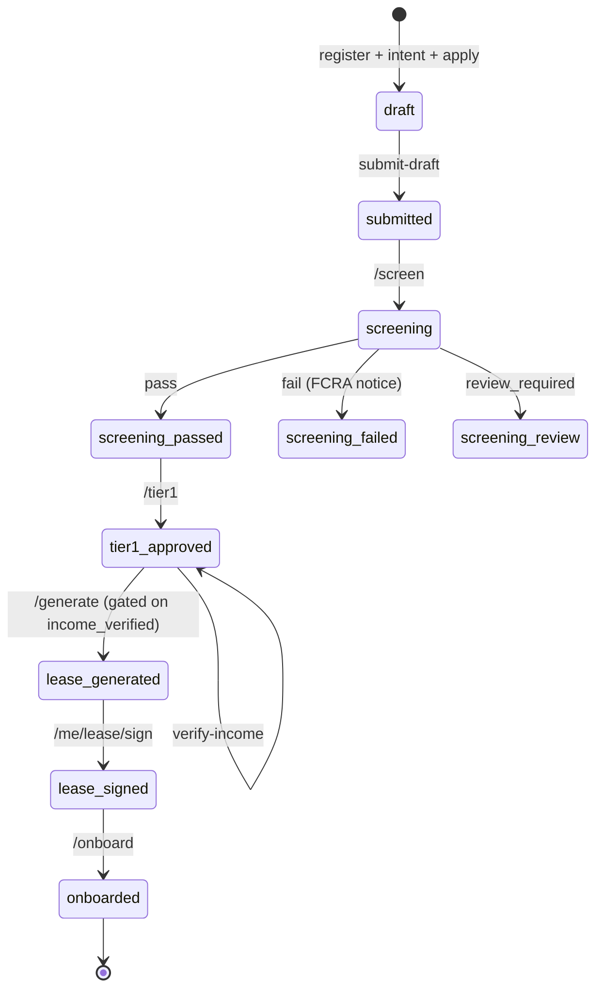
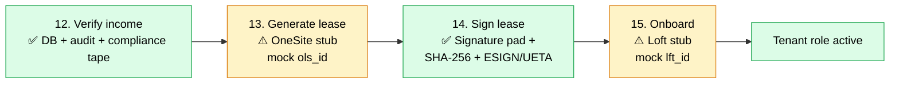

# Frank-Pilot — Onboarding API Flow (Stakeholder Read)

> **One-page read of the full applicant → tenant chain.** 16 backend APIs, two operator surfaces (applicant funnel + PM console), proven end-to-end live on `2026-05-28`. This doc shows what's real, what's a vendor stub, and what's still pending — focused on the lease-sign path where it matters most.

## Legend

| Symbol | Meaning |
| --- | --- |
| 🟢 | Fires from the **applicant tab** (tenant funnel) |
| 🟡 | Fires from the **PM console** (staff) |
| ✅ **Real** | DB-backed, audit-stamped, production-shape |
| ⚠️ **Stub** | Endpoint works end-to-end but third-party call returns a mock ID — flip an API key to go live |
| ❌ **Missing** | Not yet built |

---

## The 16-step chain (sequence)

---

## Application lifecycle (state machine)

---

## Full 16-step API status

| # | Tab | Method | Path | Purpose | Status |
| --- | --- | --- | --- | --- | --- |
| 1 | — | GET | `/health` | Backend liveness | ✅ Real |
| 2 | 🟢 | POST | `/api/applicants/register` | Create applicant + send magic-link | ✅ Real |
| 3 | 🟢 | POST | `/api/auth/magic-link/verify` | Exchange one-time token → JWT | ✅ Real |
| 4 | 🟢 | POST | `/api/applicants/intent` | Intent quiz → seeds draft application | ✅ Real |
| 5 | 🟢 | GET | `/api/applicants/units` | Filtered unit search (bedrooms, rent, AMI) | ✅ Real |
| 6 | 🟢 | POST | `/api/applicants/claim-unit/:unitId` | 48h soft hold | ✅ Real |
| 7 | 🟢 | POST | `/api/applicants/apply` | Full application (HUD-92006 stamped) | ✅ Real |
| 8 | 🟢 | POST | `/api/applicants/me/applications/submit-draft` | Lock draft → `submitted` | ✅ Real |
| 9 | 🟡 | POST | `/api/auth/login` | Staff bcrypt login | ✅ Real |
| 10 | 🟡 | POST | `/api/screening/:appId/screen` | Full pipeline: identity → fraud → bg → credit → compliance | ✅ Real *(vendor checks stubbed; pipeline real)* |
| 11 | 🟡 | POST | `/api/approvals/:appId/tier1` | Tier-1 approval | ✅ Real |
| 12 | 🟡 | PATCH | `/api/applications/:appId/verify-income` | LIHTC §42 income verification | ✅ Real |
| 13 | 🟡 | POST | `/api/leases/:appId/generate` | Generate lease document | ⚠️ Stub (OneSite returns mock `ols_<ts>`) |
| 14 | 🟢 | POST | `/api/applicants/me/lease/sign` | Native e-sign (ESIGN/UETA) | ✅ Real |
| 15 | 🟡 | POST | `/api/leases/:appId/onboard` | Promote applicant → tenant | ⚠️ Stub (Loft returns mock `lft_<ts>`) |
| 16 | 🟢 | GET | `/api/tenant/dashboard` | First tenant-role page load | ✅ Real |

---

## Lease-sign path — deep dive 🔍

The stakeholder-relevant slice is steps **12 → 15**. Here's exactly what fires today and what's stubbed:

### What's REAL on the sign path

- **Income verification** writes `income_verified=true` to the application row, fires a `LEASE_INCOME_VERIFIED` audit log, and stamps a compliance tape entry. LIHTC §42 hard gate — `/generate` throws without it.
- **E-signature itself** is production-shape: native signature pad, ESIGN/UETA consent checkbox, SHA-256 hash of the document stored in `lease_signatures`, signer IP + session ID, and a `LEASE_EXECUTED` compliance tape stamp.
- **State machine** enforces order: can't sign without `lease_generated`, can't onboard without `lease_signed`.

### What's a STUB today

- **OneSite (lease generation)** — `OneSiteService.generateLease()` exists and is called, but the API key defaults to `"changeme"` → returns `{ leaseId: "ols_<ts>" }` mock. The PDF link is `DEMO_LEASE_PDF_URL` or a canonical fallback URL, not a generated document. Flip a real key → service throws `"OneSite production API not yet configured"` (the real call isn't implemented yet either).
- **Loft (tenant onboard)** — `LoftService.createTenant()` + `setupAutoPay()` exist, same pattern: `"changeme"` → mock `lft_<ts>`. Real call not yet implemented.

### What's MISSING entirely (no endpoint yet)

| Missing capability | Why it matters | Mapped to plan |
| --- | --- | --- |
| ❌ **DocuSign envelope create + webhook** | Real third-party e-sign chain of custody, landlord countersign, audit-trail vendor of record | Onboarding master plan **Phase P2 (wk 2–4)** |
| ❌ **OneSite real API wiring** | Generate the actual lease PDF from the application | Phase P2 |
| ❌ **Loft real API wiring** | Tenant created in the rent-collection system, auto-pay enrolled | Phase P2 |
| ❌ **Countersign / `lease_fully_executed`** | Today the lease jumps `lease_generated → lease_signed`; no landlord side | Not in plan yet |
| ❌ **Deposit + first-month rent collection** | Money capture between sign and move-in (today only fires post-onboard via Stripe) | Already shipped post-onboard (BP-08); gap is *pre*-onboard |
| ❌ **Move-in inspection** | Walkthrough capture, photo + condition log, tenant ack | Not in plan yet |
| ❌ **Lease amendments / renewals** | Mid-term modifications, auto-renewal generation | Not in plan yet |

---

## TL;DR for stakeholders

- **End-to-end chain works today.** All 16 calls fire green against real Postgres, with audit logging and compliance stamps at every step.
- **Two endpoints are honest vendor stubs** — `/leases/:id/generate` (OneSite) and `/leases/:id/onboard` (Loft). The DB state machine and audit trail run through them; only the third-party side is mocked.
- **The e-signature itself is real and compliant** (ESIGN/UETA, SHA-256 document hash, IP + session capture, compliance tape stamp).
- **Biggest pending work** sits in Phase P2 of the onboarding master plan: wire DocuSign, switch OneSite + Loft from stub to live. That unlocks landlord countersign, real PDF generation, and live rent-collection enrollment.

---

*Source of truth for the chain: `scripts/demo-onboarding-end-to-end.sh` — 16 curl calls executed in order, all green. Doc generated 2026-05-28.*
