# DL2 Lease-Up Playbook — Every Step, End to End

**Building:** Donna Louise Apartments 2 (`donna-louise-apartments-2`, id `fea62c00-3e7e-4f4b-ab6f-6ffbcc75d80f`) · 48 units (30×1BR, 18×2BR) · 40/45% AMI + 6 market.
**Scope:** the full path a person travels from "I want to apply" to "approved + leased," every step, what's captured, what's validated, and what's **live vs. dark** today.
**Last verified:** 2026-06-24, by a real end-to-end run on unit A-129 (see [§7 Worked Example](#7-worked-example-the-2026-06-24-run)).

---

## 1. The framework

Every applicant moves through **five gates**. A gate is a checkpoint: you cannot enter the next one until its **exit condition** is met. This is exactly the pipeline the applicant sees on `/status`:

```
GATE 1            GATE 2          GATE 3            GATE 4        GATE 5
CAPTURE     →     SCREEN     →    DECIDE      →     LEASE    →    ONBOARD
(the funnel)      (verify        (3-tier           (generate     (move-in)
                   identity/       approval +        + sign)
                   credit/         §42 gate)
                   income)
status: submitted  screening       tier1→2→3         lease         move-in
```

Each step below is described with a fixed schema so nothing is hand-waved:

| Field | Meaning |
|---|---|
| **Actor** | 🧑 applicant · ⚙️ system (automatic) · 👔 staff (PM/manager) |
| **Surface** | the route / endpoint / service that does the work |
| **Captured** | what data the step writes |
| **Validation** | the check(s) that must pass to proceed |
| **Exit** | the condition that unlocks the next step |
| **State** | ✅ live in prod · 🌑 dark (flag-gated off) · ⚠️ manual (engine exists, runs by hand) |

**State legend matters:** a step can be *built and correct* yet **dark** because a feature flag is off. Those are called out explicitly — they are the difference between "we captured an application" and "we fully validated an applicant."

---

## 2. GATE 1 — CAPTURE (the apply funnel) ✅ LIVE

The applicant-facing wizard. 11 steps, all live. Entry: `frank-pilot-tenant.vercel.app/apply` (or the `/dl2` short link). Demo/usability runs add `?demo=<DEMO_LINK_SECRET>`.

| # | Step | Actor | Surface | Captured | Validation | Exit |
|---|------|-------|---------|----------|-----------|------|
| 1 | **Create account** | 🧑 | `/apply` → `POST /applicants/register` | first/last name, email, (phone) | email format; required name; Turnstile (prod); rate-limited 5/min/email, 30/min/IP | account created, magic link issued |
| 2 | **Verify email** | 🧑⚙️ | `/apply?step=verify` → `POST /auth/magic-link/verify` | `email_verified_at` | link valid + unexpired; sets verified flag | email verified (required for every step after) |
| 3 | **Intent / pre-qual** | 🧑⚙️ | `/apply?step=intent` → `POST /applicants/intent` + `qualifyAmiTier()` | bedrooms, budget, move-in, household size, gross income → **qualifying AMI tier** | bedrooms enum; income → tier math (HUD limits) | tier computed (e.g. "30% AMI"); draft application row created |
| 4 | **Checklist** | 🧑 | `/apply?step=checklist` | acknowledgement | "I have these" gate (gov ID, pay stubs, SSN/ITIN, refs) | proceeds to picker |
| 5 | **Pick unit** | 🧑⚙️ | `/apply?step=pick` → `GET /applicants/units` | — | property AMI filter (tier ≤ property max affordable, derived from `rent_schedule`; market always shown), bedroom/budget/move-in filters, progressive relaxation, `LIMIT 12` | a unit is chosen |
| 6 | **Claim unit** | 🧑⚙️ | `POST /applicants/claim-unit/:id` | `applications.claimed_unit_id`, unit → `held`, `claim_expires_at` (48h) | unit still available; per-user write limiter | unit held for this applicant |
| 7 | **Confirm** | 🧑 | `/apply?step=review` | — | review-before-commit ("Yes, continue") | confirmed |
| 8 | **Household / fee** | 🧑 | `/apply?step=household` | # adults (18+) | fee calc: **$35.95 × adults** | proceeds to payment |
| 9 | **Payment** | 🧑⚙️ | `/apply?step=payment` → Stripe | fee payment intent | card fields; Stripe charge (prod) / test card (demo) | fee paid |
| 10 | **Application details** | 🧑⚙️ | `/apply?step=2` (details) → `POST` application | **SSN, DOB**, address, employer, income, household, move-in | **SSN format** (`XXX-XX-XXXX` or 9 digits — submit disabled on fail); required SSN/DOB/household | details saved |
| 11 | **Submitted** | ⚙️ | `/status` | `applications.status = 'submitted'` | — | **GATE 1 cleared.** Enters Screening. |

**Gate 1 exit condition:** application `status = submitted` with a claimed unit, fee paid, identity fields captured.

> **PII boundary:** SSN / DOB / bank / ID are collected **only inside the wizard** (steps 9–10), never by text/email. The pre-qual (step 3) uses income only.

---

## 3. GATE 2 — SCREEN ⚠️🌑 (engine built, providers DARK in prod)

This is where an *application* becomes a *validated applicant*. The engine exists; the external providers are **flag-gated off**, so today an app **parks at `submitted` with no automated result** until a flag is armed or a human triggers it.

| Step | Actor | Surface | Validation | State | Flag |
|------|-------|---------|-----------|-------|------|
| 2.1 | **Identity verification** | ⚙️ | Stripe Identity | ID document + selfie match | 🌑 dark | `IDENTITY_VERIFICATION_ENABLED` |
| 2.2 | **Consumer / credit report** | ⚙️ | Checkr + TransUnion | credit + background | 🌑 dark | `CONSUMER_REPORT_ENABLED` |
| 2.3 | **Extended checks** | ⚙️ | provider | eviction / criminal (as configured) | 🌑 dark | `SCREENING_EXTENDED_CHECKS_ENABLED` |
| 2.4 | **Auto-run on submit** | ⚙️ | screening service | kick screening the moment step 11 fires | 🌑 dark | `SCREENING_ON_SUBMIT_ENABLED` |
| 2.5 | **§42 income eligibility** | ⚙️/👔 | compliance engine | household income ≤ the unit's AMI ceiling (e.g. 1BR @45% → ≤ $33,255) | ⚠️ engine live, gated by the income docs | — |

**Today's reality:** with 2.1–2.4 off, a submitted app shows `overall_screening_result = null` and does **not** advance on its own. To validate an applicant you must either (a) **arm the flags** (runbook: [`docs/runbooks/checkr-cra-arming.md`](runbooks/checkr-cra-arming.md)) so screening runs automatically, or (b) run screening **manually** and record the result.

**Gate 2 exit condition:** identity verified + consumer report returned + §42 income confirmed ⇒ status moves toward `tier1_review`. A failure routes to `screening_failed`.

---

## 4. GATE 3 — DECIDE (3-tier approval) ✅ engine live · 👔 staff

Separation-of-duties approval chain. Each tier is a distinct role; the same person cannot rubber-stamp all three. Permissions: `approval:tier1` (senior_manager+), `approval:tier2`, `approval:tier3`.

| Step | Actor | Decision states | Notes |
|------|-------|-----------------|-------|
| 3.1 | **Tier-1 review** | 👔 senior_manager | `tier1_review` → `tier1_approved` / `tier1_denied` | first human look post-screening |
| 3.2 | **Tier-2 review** | 👔 regional_manager | `tier2_review` → `tier2_approved` / `tier2_denied` | second sign-off |
| 3.3 | **Tier-3 review** | 👔 asset_manager | `tier3_review` → approved / denied | final authority |
| 3.4 | **§42 compliance gate** | ⚙️/👔 | pass / fail | the deliberate income-verification hold — the real human bottleneck on time-to-approval |

A `fail` at any tier (or screening) auto-generates an adverse-action / denial record (e.g. `tier1_denied`, `screening_failed`).

**Gate 3 exit condition:** all three tiers approved + §42 satisfied ⇒ **Approved**.

---

## 5. GATE 4 — LEASE ✅ engine live · 👔 staff

| Step | Actor | Surface | Output |
|------|-------|---------|--------|
| 4.1 | **Generate lease** | 👔/⚙️ | LeaseService | lease document for the approved unit + tier |
| 4.2 | **Send for signature** | ⚙️ | e-sign | applicant signs |
| 4.3 | **Countersign** | 👔 | — | executed lease |

**Gate 4 exit condition:** lease fully executed.

---

## 6. GATE 5 — ONBOARD ✅

| Step | Actor | Output |
|------|-------|--------|
| 5.1 | **Move-in scheduling** | 👔🧑 | move-in date set |
| 5.2 | **Keys / occupancy** | 👔 | unit occupied; final per-unit AMI designation set in OneSite at lease-up |

**Gate 5 exit condition:** tenant moved in. Lease-up counter +1 (DL2 target: 48 approved leases by 2026-07-10).

---

## 7. Validation matrix (what actually gets checked, and where)

| Validation | Gate / step | State | Enforced by |
|---|---|---|---|
| Email format + ownership | 1.1 / 1.2 | ✅ | register schema + magic link |
| Bot / abuse | 1.1 | ✅ | Turnstile + rate limiters |
| AMI tier eligibility (pre-qual) | 1.3 | ✅ | `qualifyAmiTier()` (HUD limits) |
| Unit availability / hold | 1.6 | ✅ | claim transaction + 48h expiry |
| Fee paid | 1.9 | ✅ (prod Stripe; demo test card) | Stripe |
| SSN format | 1.10 | ✅ | client form (submit disabled on fail) |
| Required identity fields | 1.10 | ✅ | required SSN/DOB/household |
| **Identity (ID + selfie)** | 2.1 | 🌑 | Stripe Identity — `IDENTITY_VERIFICATION_ENABLED` |
| **Credit / background** | 2.2 | 🌑 | Checkr + TransUnion — `CONSUMER_REPORT_ENABLED` |
| **§42 income ≤ AMI ceiling** | 2.5 / 3.4 | ⚠️ | compliance engine + income docs |
| 3-tier approval (SoD) | 3.1–3.3 | ✅ engine | ApprovalService, role permissions |

**The headline:** every **capture** validation (Gate 1) is **live and verified**. The **applicant-validation** checks (Gate 2: identity, credit, auto-screening) are **dark**. That is the single thing between "application submitted" and "applicant fully validated."

---

## 8. What's needed for a *true* full validation

To make a submission flow automatically from `submitted` → screened → tier review (instead of parking at `submitted`):

1. **Arm the CRA flags** per [`docs/runbooks/checkr-cra-arming.md`](runbooks/checkr-cra-arming.md): `IDENTITY_VERIFICATION_ENABLED`, `CONSUMER_REPORT_ENABLED`, `SCREENING_ON_SUBMIT_ENABLED` (+ `SCREENING_EXTENDED_CHECKS_ENABLED` if used).
2. **Grant staff the approval permissions** (`approval:tier1/2/3`, `screening:initiate`, `lease:generate`) so the human gates in Gates 3–4 can act.
3. **Decide the fee posture** for real applicants (the $35.95 is live; comp / waive / collect).

Until #1, the system can **capture and manually review** but not **auto-validate**.

---

## 9. Worked example — the 2026-06-24 run

A real end-to-end pass, demo harness, on DL2:

- Account `dl2.smoke.0624@example.com` → email verified (demo magic link).
- Intent: 1BR, household 1, income **$18,000** → pre-qual **"30% AMI"**.
- Picker showed DL2 at real rents; **claimed A-129 ($791, the 40% 1BR)** — "Unit A-129 is yours."
- Confirm → household/fee ($35.95) → payment (demo test card, no real charge).
- Details: fed a bad SSN ("111") → **submit blocked, "SSN must be XXX-XX-XXXX or 9 digits"**; corrected to valid → submitted.
- Landed on `/status`: **"Donna Louise Apartments 2 · Submitted, Step 1 of 5"** (1 Submitted ✓ → 2 Screening → 3 PM review → 4 Lease → 5 Move-in), Submitted Jun 24, 2026.

**Result:** Gate 1 fully proven on a real DL2 unit. App then parked at `submitted` (Gate 2 dark), exactly as the framework predicts.

> Cleanup: that demo app holds A-129 — purge with `scripts/purge-demo-data.mjs` before real applicants.

---

## 10. Quick reference — data + systems

- **Application funnel + units + applications:** frank-pilot (Railway `api`), Postgres on Railway.
- **Property / unit data op:** `src/db/onboard-property.ts` (honors per-tier `_ami_breakdown`).
- **Waitlist (interest, pre-funnel):** GPM Donna list (`gpm_waitlist_applicants` on Sage) — *separate* from this funnel; a waitlist entry is **not** an application.
- **Screening arming:** `docs/runbooks/checkr-cra-arming.md`.
- **Unit resync:** `docs/runbooks/donna-louise-2-units-resync.md`.

---

## 11. Flowchart (source)

Rendered PNG lives alongside this doc; the source below renders on GitHub. Legend: **green = live/verified**, **red dashed = dark (flag-gated)**, **amber = manual**, **grey = denial branch**, **indigo = waitlist (separate from the funnel)**.

```mermaid
flowchart TD
  START([Applicant arrives]) --> SRC{How did<br/>they come?}
  SRC -->|Waitlist interest| WL[(GPM waitlist · Sage<br/>NOT an application)]
  SRC -->|Direct / dl2 link| S1
  WL -.must still apply.-> S1
  subgraph G1[GATE 1 · CAPTURE — LIVE]
    direction TB
    S1[1 Create account] --> S2[2 Verify email · magic link]
    S2 --> S3[3 Intent + pre-qual income to AMI tier]
    S3 --> Q1{Income<br/>qualifies?}
    Q1 -->|Over income| MKT[Market units only]
    Q1 -->|AMI tier OK| S4[4 Checklist]
    MKT --> S4
    S4 --> S5[5 Pick unit]
    S5 --> Q2{Units<br/>available?}
    Q2 -->|None| WLJOIN[Join waitlist]
    Q2 -->|Yes| S6[6 Claim unit · 48h hold]
    S6 --> S7[7 Confirm]
    S7 --> S8["8 Household + fee $35.95/adult"]
    S8 --> S9[9 Payment]
    S9 --> Q3{Paid?}
    Q3 -->|Fail| S9
    Q3 -->|OK| S10[10 Details · SSN / DOB]
    S10 --> Q4{Valid?}
    Q4 -->|"SSN / required fail"| S10
    Q4 -->|OK| S11([11 SUBMITTED])
  end
  S11 --> SC1
  subgraph G2[GATE 2 · SCREEN — DARK in prod]
    direction TB
    SC1[2.1 Identity · Stripe] --> SC2[2.2 Credit + background · Checkr / TransUnion]
    SC2 --> SC3[2.3 Extended checks]
    SC3 --> SC4["2.5 Section 42 income within AMI ceiling"]
    SC4 --> Q5{Screen<br/>pass?}
    Q5 -->|Fail| DENY1[screening_failed · adverse action]
  end
  Q5 -->|Pass| T1
  subgraph G3[GATE 3 · DECIDE — engine LIVE]
    direction TB
    T1[tier1 review · senior mgr] --> Q6{Approve?}
    Q6 -->|Deny| DENY2[tier1_denied]
    Q6 -->|Yes| T2[tier2 review · regional]
    T2 --> Q7{Approve?}
    Q7 -->|Deny| DENY3[tier2_denied]
    Q7 -->|Yes| T3[tier3 review · asset mgr]
    T3 --> Q8{Approve<br/>+ Section 42?}
    Q8 -->|Deny| DENY4[denied]
    Q8 -->|Yes| APP([APPROVED])
  end
  APP --> L1
  subgraph G4[GATE 4 · LEASE — LIVE]
    direction TB
    L1[Generate lease] --> L2[Applicant signs] --> L3[Countersign · executed]
  end
  L3 --> O1
  subgraph G5[GATE 5 · ONBOARD — LIVE]
    direction TB
    O1[Move-in scheduling] --> O2([Keys · occupied · +1 lease-up])
  end
  classDef live fill:#dcfce7,stroke:#16a34a,color:#14532d;
  classDef dark fill:#fee2e2,stroke:#dc2626,stroke-dasharray:5 5,color:#7f1d1d;
  classDef manual fill:#fef9c3,stroke:#ca8a04,color:#713f12;
  classDef deny fill:#f3f4f6,stroke:#6b7280,color:#374151;
  classDef wl fill:#e0e7ff,stroke:#4f46e5,color:#312e81;
  class S1,S2,S3,S4,S5,S6,S7,S8,S9,S10,S11,MKT live;
  class SC1,SC2,SC3 dark;
  class SC4 manual;
  class T1,T2,T3 live;
  class L1,L2,L3,O1,O2 live;
  class DENY1,DENY2,DENY3,DENY4 deny;
  class WL,WLJOIN wl;
```



---

## 12. Inventory — every piece, HAVE vs PENDING

Status key: ✅ **live** (working in prod) · 🟡 **built, off** (code exists, feature flag disabled) · ⚠️ **manual** (engine exists, runs by hand) · ⬜ **pending** (decision or action needed) · ❓ **verify** (believed built, not re-confirmed this pass).

### Gate 1 — Capture
| Piece | Status | Evidence / note |
|---|---|---|
| Account register + magic-link auth | ✅ | verified in run; Turnstile + rate limits live |
| Email verification gate | ✅ | required for all post-steps |
| Intent + AMI pre-qual (`qualifyAmiTier`) | ✅ | computed "30% AMI" in run |
| Checklist | ✅ | — |
| Unit picker — AMI tier from `rent_schedule` | ✅ | **PR #351** (merged + deployed) |
| Picker property-scope + slug resolver | ✅ | **PR #352** (merged + deployed) |
| Legacy slug aliases (`donna-louise-{1,2}`) | 🟡 | **PR #355** merged, **deploy pending** |
| Unit claim + 48h hold | ✅ | claimed A-129 in run |
| Household + fee calculator ($35.95/adult) | ✅ | — |
| Payment (Stripe) | ✅ | prod live; demo uses test card |
| Details capture + SSN/required validation | ✅ | bad SSN blocked in run |
| Submit → `/status` pipeline | ✅ | reached "Submitted, Step 1 of 5" |
| DL2 real inventory (Dora-accurate 48 units) | ✅ | resynced to prod 2026-06-24 |
| `onboard-property.ts` + per-tier `_ami_breakdown` | ✅ | **PR #358** (merged) |

### Gate 2 — Screen (the pending layer)
| Piece | Status | Flag / note |
|---|---|---|
| Identity verification (Stripe Identity) | 🟡 | `IDENTITY_VERIFICATION_ENABLED` off |
| Consumer / credit + background (Checkr, TransUnion) | 🟡 | `CONSUMER_REPORT_ENABLED` off |
| Extended checks (eviction/criminal) | 🟡 | `SCREENING_EXTENDED_CHECKS_ENABLED` off |
| Auto-run screening on submit | 🟡 | `SCREENING_ON_SUBMIT_ENABLED` off |
| FCRA §1681b consent capture | ✅ enforced | `consumer_report_authorizations` (records disclosure text + SHA-256 hash + version `2026-06-01` + IP/UA); **hard precondition** at submit + fee-webhook — no consent, no pull (audited 2026-06-24). Overlay only surfaces when `CONSUMER_REPORT_ENABLED` is on. |
| §42 income eligibility (income ≤ AMI ceiling) | ⚠️ | engine live; needs income docs + manual confirm |
| Arming runbook | ✅ | `docs/runbooks/checkr-cra-arming.md` (arming itself ⬜) |

### Gate 3 — Decide
| Piece | Status | Note |
|---|---|---|
| 3-tier approval engine (tier1→2→3, SoD) | ✅ engine | `ApprovalService.tier{1,2,3}Review` |
| Staff approval permissions granted to people | ⬜ | `approval:tier1/2/3`, `screening:initiate`, `lease:generate` — assign to real staff |
| §42 compliance gate | ⚠️ | deliberate income-verify hold |
| Adverse-action / denial records | ✅ engine | auto on `fail` |

### Gate 4 — Lease
| Piece | Status | Note |
|---|---|---|
| Lease generation (LeaseService) | ✅ engine | — |
| E-sign + countersign | ❓ | confirm live signature path |

### Gate 5 — Onboard
| Piece | Status | Note |
|---|---|---|
| Move-in scheduling / keys | ❓ | likely operator/OneSite |
| Final per-unit AMI designation | ⚠️ | set in OneSite at lease-up (by design) |

### Supporting / adjacent
| Piece | Status | Note |
|---|---|---|
| Outbound validation dialer (Donna Louise) | 🟡 | built (frank-pilot #345 + bs #128); `FRANK_OUTBOUND_ENABLED` off |
| `/dl2` QR redirect | 🟡 | 302s with `?source=dl2-qr`; add `?propertyId=donna-louise-2` for scoped landing (Sage `qr_redirects` data change) |
| GPM waitlist (`gpm_waitlist_applicants`, Sage) | ✅ | exists; a waitlist entry is **not** an application |
| Demo/usability harness + purge | ✅ | `?demo=<secret>`, `scripts/purge-demo-data.mjs` |
| This playbook + flowchart | ✅ | `docs/DL2-LEASE-UP-PLAYBOOK.md` |

---

## 13. Pending — ordered action list

**To unlock a true full validation (capture → screen → approve → lease):**

1. ⬜ **Arm screening — the single biggest unlock, but NO-GO for a same-day global flip** (audited 2026-06-24). FCRA consent is *not* the blocker (it's built + enforced, §Gate 2). The blockers are validation + operational, so it's a phased rollout:
   - **🔴 CRITICAL first — sandbox-validate the vendor report shapes.** The Checkr/TransUnion response mappers are unverified against live sandboxes (`background-check.ts` / `credit-check.ts`, `TODO(credentialing)`). If a report carries reference IDs instead of inline records, a criminal/eviction hit can map to **0 = a silent false-clean PASS**. Must drive sandbox submits with **known non-clean fixtures** (felony, sex-offender, eviction, low score) and assert they produce non-clean verdicts *before* prod.
   - **Then deploy `main` to prod** (`railway up --service api`) — note this also ships a Stripe v17→v22 major bump; smoke `/health` + a payment round-trip first.
   - **Set the real CRA identity** (`CRA_NAME/ADDRESS/PHONE` — currently placeholders; adverse-action notices are non-compliant until set) + both vendors' prod keys + webhook secrets, register webhooks → `/api/webhooks/cra`.
   - **Flip both vendors together, `CONSUMER_REPORT_ENABLED` last**: `SCREENING_ON_SUBMIT_ENABLED=true` + `IDENTITY_VERIFICATION_ENABLED=true` + the keys, then `CONSUMER_REPORT_ENABLED=true`. (Half-armed = every consented submit holds; the `isConfigured()` preflight on `main` makes it a safe no-op, not an orphan.)
   - Full checklist: `docs/runbooks/checkr-cra-arming.md` — *note the runbook's PR #283 status is stale (that preflight is already on `main`); re-verify its blocker list before using.*
   - **Single-applicant note:** there is **no** per-applicant real-CRA override in prod — a real pull requires the global flag (or a staging env with sandbox keys). Manual *adjudication* of an already-pulled report is possible anytime via `POST …/screening/:id/screen` (`screening:initiate`, Senior Mgr+).
2. ⬜ **Grant staff approval permissions** so Gates 3–4 can act on real applicants (`approval:tier1/2/3`, `screening:initiate`, `lease:generate`).
3. ⬜ **Decide fee posture** for real applicants ($35.95 live; comp / waive / collect).

**Smaller / housekeeping:**
4. ⬜ **Deploy #355** (`railway up`) so the slug aliases go live (enhancement, not blocking).
5. ⬜ **`qr_redirects` `/dl2`** → add `?propertyId=donna-louise-2` for a DL2-scoped landing.
6. ⬜ **Purge the demo app** holding A-129 (`scripts/purge-demo-data.mjs`).
7. ❓ **Verify** the e-sign/countersign path (Gate 4) and the FCRA consent capture (Gate 2) end-to-end.

**For Jaqueline specifically:**
8. ⬜ She is **not** in this funnel (confirmed). Send her the secure apply link (your 1-for-1 approval) to run her through Gates 1→2 as the first real applicant — once screening is armed, she becomes the first *fully validated* one.
